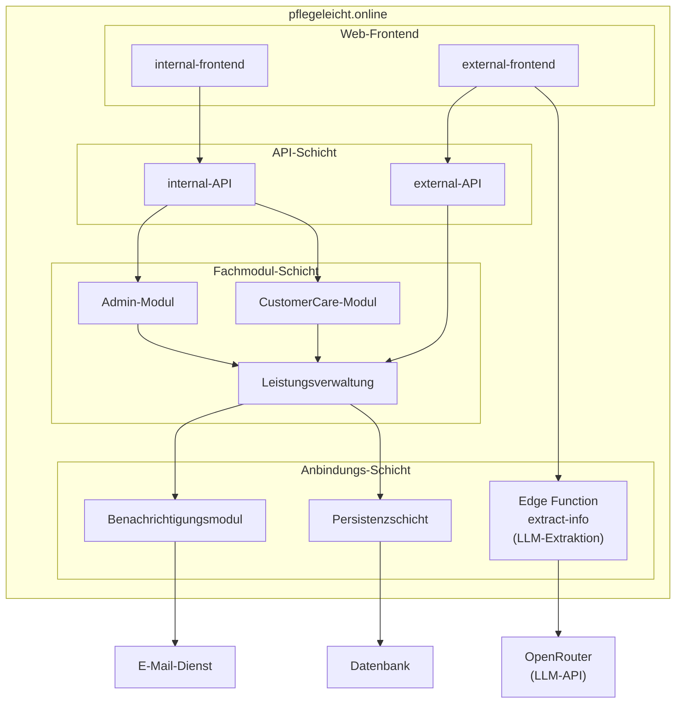

# Bausteinsicht

Diese Bausteinsicht leitet sich aus dem bestehenden Kontextdiagramm von `pflegeleicht.online` ab und zerlegt das System in zentrale interne Bausteine.

## Baustein-Überblick

## Bausteine

- `External-Frontend`: Einstiegspunkt für externe Nutzer:innen und Übergabe von Anfragen an die `external-API`; kann **clientseitig** eine **OCR-Bibliothek** (Texterkennung) nutzen, um aus hochgeladenen Nachweisdokumenten (z. B. PNG) lesbaren Text zu gewinnen. Aus diesem Freitext können strukturierte Felder (z. B. Name, Adresse, Pflegegrad) per Aufruf der Edge Function **`extract-info`** gewonnen werden; diese nutzt im MVP die externe **OpenRouter**-LLM-API (siehe ADR-006, ADR-007). Nutzer:innen prüfen und bestätigen die Daten vor dem formalen Antrag.
- `Internal-Frontend`: Arbeitsoberfläche für interne Rollen und Übergabe von Anfragen an die `internal-API`.
- `external-API`: Schnittstelle für externe Frontend-Anfragen und Weiterleitung an die `Leistungsverwaltung`.
- `internal-API`: Schnittstelle für interne Frontend-Anfragen und Orchestrierung in `Leistungsverwaltung`, `Admin-Modul` und `CustomerCare-Modul`.
- `Leistungsverwaltung`: Zentrale Fachlogik zur Verarbeitung von Leistungen und zur Ansteuerung von Benachrichtigung und Persistenz.
- `CustomerCare-Modul`: Unterstützt CustomerService-Prozesse und Kundenanliegen.
- `Admin-Modul`: Stellt administrative Funktionen und Systempflege bereit.
- `Benachrichtigungsmodul`: Erzeugt und versendet E-Mails über den externen E-Mail-Dienst.
- `Persistenzschicht`: Kapselt Lese-/Schreibzugriffe auf die Datenbank.
- Edge Function **`extract-info`**: Nimmt **Freitext** (JSON-Feld `text`) entgegen, ruft über **OpenRouter** ein konfiguriertes Sprachmodell auf und liefert strukturiertes **JSON** für Antragsfelder zurück; **kein** Ersatz für fachliche Validierung oder Nutzerprüfung (ADR-007).

## Schichten

- Oberste Schicht (`internal-frontend`, `external-frontend`): UI für interne und externe Nutzergruppen; beim **external-frontend** können ressourcenintensive Hilfen (z. B. OCR) bewusst im Browser laufen. **LLM-Aufrufe** laufen nicht im Browser (Schutz des API-Keys), sondern in **`extract-info`** mit Anbindung an **OpenRouter**.
- API-Schicht (`external-API`, `internal-API`): Entkopplung der Frontends von der Fachlogik.
- Fachmodul-Schicht (`Leistungsverwaltung`, `Admin-Modul`, `CustomerCare-Modul`): Fachliche Verarbeitung und interne Orchestrierung.
- External-Service-Anbindungs-Schicht (`Benachrichtigungsmodul`, `Persistenzschicht`, serverseitige Hilfsfunktionen wie **`extract-info`**): Anbindung externer Dienste und technische Kapselung von Infrastrukturzugriffen (E-Mail, Datenbank, **OpenRouter**).

## Abgrenzung

- Externe Systeme (`E-Mail-Dienst`, `Datenbank`, **OpenRouter**) bleiben außerhalb der Systemgrenze; die Plattform kapselt Zugriffe darauf über eigene Bausteine (Persistenz, Benachrichtigung, Edge Functions).

