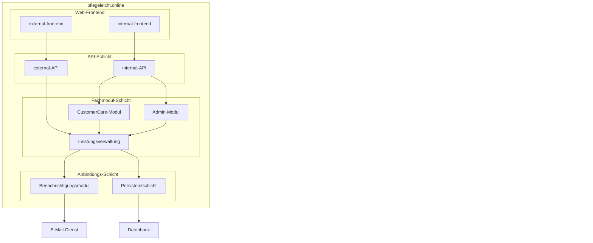

# Bausteinsicht

Diese Bausteinsicht leitet sich aus dem bestehenden Kontextdiagramm von `pflegeleicht.online` ab und zerlegt das System in zentrale interne Bausteine.

## Baustein-Ueberblick

## Bausteine

- `External-Frontend`: Einstiegspunkt fuer externe Nutzer:innen und Uebergabe von Anfragen an die `external-API`.
- `Internal-Frontend`: Arbeitsoberflaeche fuer interne Rollen und Uebergabe von Anfragen an die `internal-API`.
- `external-API`: Schnittstelle fuer externe Frontend-Anfragen und Weiterleitung an die `Leistungsverwaltung`.
- `internal-API`: Schnittstelle fuer interne Frontend-Anfragen und Orchestrierung in `Leistungsverwaltung`, `Admin-Modul` und `CustomerCare-Modul`.
- `Leistungsverwaltung`: Zentrale Fachlogik zur Verarbeitung von Leistungen und zur Ansteuerung von Benachrichtigung und Persistenz.
- `CustomerCare-Modul`: Unterstuetzt CustomerService-Prozesse und Kundenanliegen.
- `Admin-Modul`: Stellt administrative Funktionen und Systempflege bereit.
- `Benachrichtigungsmodul`: Erzeugt und versendet E-Mails ueber den externen E-Mail-Dienst.
- `Persistenzschicht`: Kapselt Lese-/Schreibzugriffe auf die Datenbank.

## Schichten

- Oberste Schicht (`internal-frontend`, `external-frontend`): UI fuer interne und externe Nutzergruppen.
- API-Schicht (`external-API`, `internal-API`): Entkopplung der Frontends von der Fachlogik.
- Fachmodul-Schicht (`Leistungsverwaltung`, `Admin-Modul`, `CustomerCare-Modul`): Fachliche Verarbeitung und interne Orchestrierung.
- External-Service-Anbindungs-Schicht (`Benachrichtigungsmodul`, `Persistenzschicht`): Anbindung externer Dienste und technische Kapselung von Infrastrukturzugriffen (E-Mail, Datenbank).

## Abgrenzung

- Externe Systeme (`E-Mail-Dienst`, `Datenbank`) bleiben ausserhalb der Systemgrenze.

