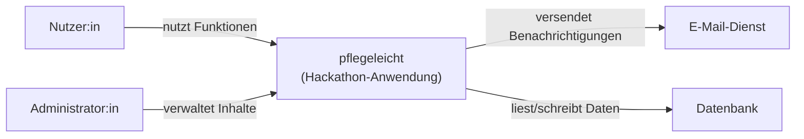

# Kontextdiagramm

Dieses Diagramm zeigt den Systemkontext von **pflegeleicht** auf hoher Ebene.

## Annahmen

- `pflegeleicht` ist das zentrale Softwaresystem.
- Nutzer:innen interagieren direkt mit dem System.
- Das System nutzt einen externen E-Mail-Dienst und eine Datenbank.
