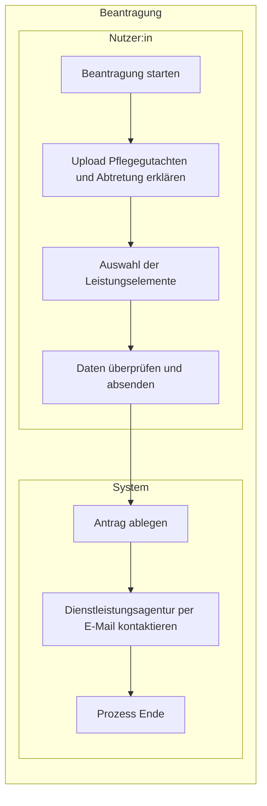

# Laufzeitsicht

Diese Laufzeitsicht beschreibt, wie `pflegeleicht.online` den Entlastungsbetrag für Nutzer:innen mit Pflegegrad im MVP Ende-zu-Ende automatisiert.

## Vereinfachtes BPMN-Diagramm für die erste Beantragung (MVP End-to-End)

## Nachweis-Upload und Texterkennung (externes Frontend)

Im Schritt „Upload Pflegegutachten und Abtretung erklären“ kann das **external-frontend** im **Browser** eine **OCR-Bibliothek** ausführen (Texterkennung aus PDF oder Bild), um Eingaben vorzuschlagen, Pflegegrad oder Stammdaten plausibel zu machen oder die Nutzer:innen sonst zu entlasten. Diese Verarbeitung läuft **clientseitig**, bevor der formale Antrag an die Plattform übergeben wird.

Die **serverseitige** Abfolge (Antrag ablegen, Datei in Storage, Persistenz, Benachrichtigung) bleibt unverändert der zentralen Laufzeit in Supabase vorbehalten — siehe [Verteilungssicht](verteilungssicht.md) und [Architekturentscheidungen](architekturentscheidungen.md) (ADR-006).

## Fachliche Leitplanken

- Das System reduziert Komplexität für Nutzer:innen auf wenige, leicht verständliche Klicks.
- Der Abtretungs- bzw. Handlungsauftrag ist notwendige Voraussetzung für die Automatisierung in ihrem Namen.
- Die Plattform verdient an der Differenz zwischen Kassenerstattung und Anbieterkosten; für Nutzer:innen bleibt der Prozess kostenfrei.
- Die Laufzeitarchitektur bleibt erweiterbar für spätere Leistungen (z. B. Pflegehilfsmittel, Verhinderungspflege), ohne den MVP-Flow zu verkomplizieren.

