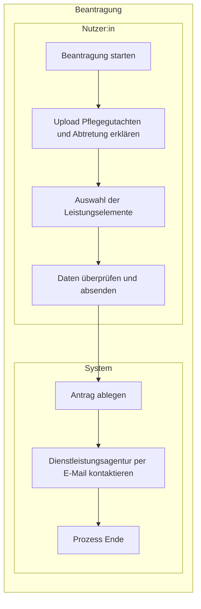

# Laufzeitsicht

Diese Laufzeitsicht beschreibt, wie `pflegeleicht.online` den Entlastungsbetrag für Nutzer:innen mit Pflegegrad im MVP Ende-zu-Ende automatisiert.

## Vereinfachtes BPMN-Diagramm für die erste Beantragung (MVP End-to-End)

## Nachweis-Upload, Texterkennung und LLM-Extraktion (externes Frontend)

Im Schritt „Upload Pflegegutachten und Abtretung erklären“ kann das **external-frontend** im **Browser** eine **OCR-Bibliothek** ausführen (Texterkennung aus Bild), um lesbaren **Freitext** aus dem Nachweis zu erhalten.

Dieser extrahierte Text wird an die Supabase-Edge-Function **`extract-info`** gesendet werden (`POST` mit JSON-Feld `text`). Die Function ruft die **OpenRouter**-API (`https://openrouter.ai/api/v1/chat/completions`) mit einem **System-Prompt** auf und liefert strukturiertes **JSON** für Antragsfelder zurück (Vorschläge). **OCR** und **Transport zum Backend** für die Extraktion laufen nacheinander; der **API-Key** für das LLM liegt nur **serverseitig** in der Function-Umgebung.

Nutzer:innen **prüfen und korrigieren** die vorgeschlagenen Felder, bevor der formale Antrag ausgelöst wird. Die **serverseitige** Abfolge des eigentlichen Antrags (Antrag ablegen, Datei in Storage, Persistenz, Benachrichtigung) bleibt der Edge Function **`process-antrag`** und der übrigen Supabase-Laufzeit vorbehalten — siehe [Verteilungssicht](verteilungssicht.md) und [Architekturentscheidungen](architekturentscheidungen.md) (ADR-006, ADR-007).

**Ausblick:** Für eine datenschutzfreundlichere Verarbeitung (u. a. **DSGVO**, Kontrolle über Auftragsverarbeitung und Datenflüsse) ist vorgesehen, OpenRouter durch ein **lokales LLM** zu ersetzen oder zu ergänzen, ohne den fachlichen Ablauf (Freitext → strukturierte Felder → Nutzerprüfung) zu ändern.

## Fachliche Leitplanken

- Das System reduziert Komplexität für Nutzer:innen auf wenige, leicht verständliche Klicks.
- Der Abtretungs- bzw. Handlungsauftrag ist notwendige Voraussetzung für die Automatisierung in ihrem Namen.
- Die Plattform verdient an der Differenz zwischen Kassenerstattung und Anbieterkosten; für Nutzer:innen bleibt der Prozess kostenfrei.
- Die Laufzeitarchitektur bleibt erweiterbar für spätere Leistungen (z. B. Pflegehilfsmittel, Verhinderungspflege), ohne den MVP-Flow zu verkomplizieren.

