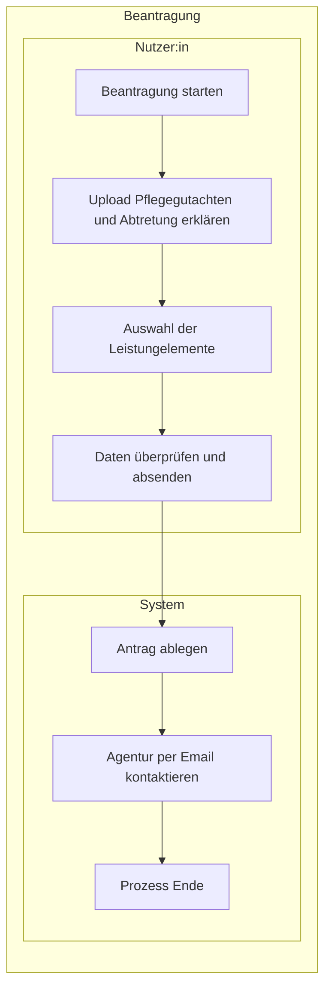

# Laufzeitsicht

Diese Laufzeitsicht beschreibt, wie `pflegeleicht.online` den Entlastungsbetrag fuer Nutzer:innen mit Pflegegrad im MVP-Ende-zu-Ende automatisiert.

## Vereinfachtes BPMN Diagramm für die erst Beantragung (MVP End-to-End)

## Fachliche Leitplanken

- Das System reduziert Komplexitaet fuer Nutzer:innen auf wenige, leicht verstaendliche Klicks.
- Der Abtretungs- bzw. Handlungsauftrag ist notwendige Voraussetzung fuer die Automatisierung in ihrem Namen.
- Die Plattform verdient an der Differenz zwischen Kassenerstattung und Anbieterkosten; fuer Nutzer:innen bleibt der Prozess kostenfrei.
- Die Laufzeitarchitektur bleibt erweiterbar fuer spaetere Leistungen (z. B. Pflegehilfsmittel, Verhinderungspflege), ohne den MVP-Flow zu verkomplizieren.

