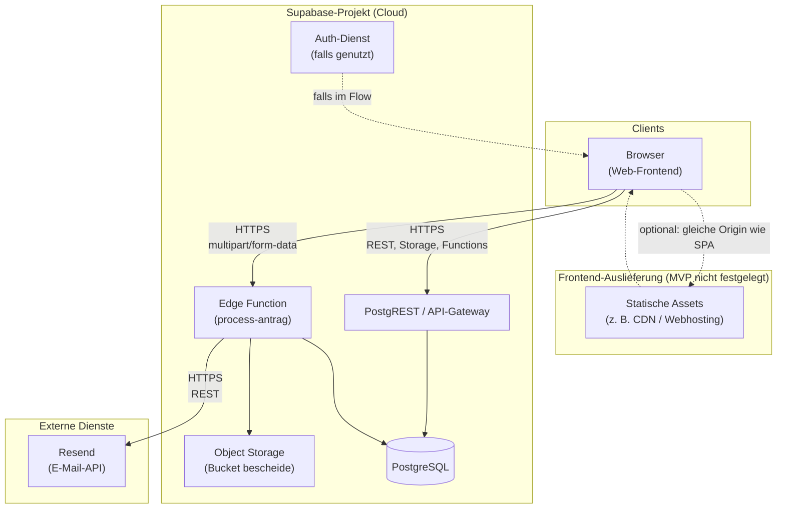

# Verteilungssicht (arc42 Abschnitt 7)

Diese Verteilungssicht beschreibt, **wo** die Bausteine von `pflegeleicht.online` zur Laufzeit liegen und wie sie in den Umgebungen **lokal** (Entwicklung) und **gehostet** (Supabase-Cloud, MVP) miteinander verbunden sind. Sie ergänzt [bausteinsicht.md](bausteinsicht.md) und [kontext-diagramm.md](kontext-diagramm.md).

## Zielumgebungen

| Umgebung | Zweck | Kurzbeschreibung |
|----------|--------|------------------|
| **Lokal** | Entwicklung und Demos auf dem Rechner | Docker-basierter Supabase-Stack (`npx supabase start`), Vite-Dev-Server für das Web-Frontend |
| **Gehostet (MVP)** | gemeinsames Backend / APIs in der Cloud | Ein Projekt bei [Supabase](https://supabase.com): verwaltete PostgreSQL-Datenbank, REST/RPC-API, Storage, Edge Functions |

Das **Web-Frontend** wird lokal mit Vite unter `http://localhost:5173` gestartet; ein konkretes Produktions-Hosting (CDN, Domain, CI/CD) ist im Repository **nicht** festgeschrieben. Für den produktiven Betrieb wäre üblich: statische Auslieferung des Vite-Builds (`npm run build` im Ordner `frontend/`) plus Konfiguration der Supabase-Projekt-URL und des öffentlichen Anon-Keys in der Client-Umgebung.

## Verteilungsdiagramm (logisch)

In der **lokalen** Variante entspricht der Block „Supabase-Projekt“ dem per Docker gestarteten Stack (andere Hostnamen und Ports, siehe unten); die Rolle der Komponenten bleibt gleich.

## Knoten und Artefakte

- **Web-Frontend:** React-SPA (Vite), Bausteine `external-frontend` / `internal-frontend` aus der Bausteinsicht; spricht per HTTPS mit dem Supabase-Projekt (API, Storage, Edge Functions).
- **Supabase API:** öffentlich erreichbar unter `https://<project-ref>.supabase.co` (exakter Host aus Dashboard bzw. nach `npx supabase link`, siehe [README.md](../../README.md)).
- **Edge Function `process-antrag`:** läuft in der Supabase-Functions-Laufzeit; Endpunkt `POST .../functions/v1/process-antrag`; Zugriff auf Datenbank, privaten Storage-Bucket und E-Mail-Versand.
- **PostgreSQL:** verwaltete Instanz im Supabase-Projekt; Schema über Migrationen unter `supabase/migrations/`.
- **Storage:** Bucket `bescheide` für PDF-Uploads (siehe README / Migrationen).
- **E-Mail:** ausgehender Versand über **Resend** (HTTPS-API; Secret im Dashboard: `RESEND_API_KEY`).

Geheimnisse und umgebungsspezifische Werte liegen **nicht** im Repository; sie werden lokal (`.env` / CLI) bzw. im Supabase-Dashboard gepflegt.

## Lokale Verteilung (Entwicklung)

| Baustein | Typische URL / Port | Hinweis |
|----------|---------------------|---------|
| Web-Frontend (Vite) | `http://localhost:5173` | `cd frontend && npm run dev` |
| Supabase API | `http://127.0.0.1:54321` | aus `supabase/config.toml` |
| PostgreSQL | Port `54322` (localhost) | nur aus dem Entwicklernetzwerk / Docker |
| Supabase Studio | `http://127.0.0.1:54323` | Admin-Oberfläche für lokales Projekt |

## Gehostete Verteilung (MVP)

- **Datenbank und API:** `npx supabase db push` spielt Migrationen auf die Remote-Datenbank des verknüpften Projekts (Project-Ref im Dashboard bzw. `supabase link`, siehe README).
- **Edge Functions:** `npx supabase functions deploy process-antrag` deployt die Function in dieselbe Supabase-Region wie das Projekt.
- **Nach dem Deploy:** u. a. Auth-`site_url` und Edge-Function-Secrets im Dashboard setzen (siehe README).

## Netzwerk- und Zugriffspfade

- **Browser → Supabase:** TLS (HTTPS); Authentifizierung gegenüber der API typischerweise mit dem öffentlichen `anon`-Key des Projekts (nur im Client konfigurieren, was öffentlich sein darf).
- **Edge Function → Datenbank / Storage:** innerhalb der Supabase-Plattform; keine direkte Exposition der Datenbank ans öffentliche Internet für Client-Zugriffe außerhalb des Supabase-Gateways.
- **Edge Function → Resend:** ausgehende HTTPS-Verbindung zur Resend-API (`https://api.resend.com`); Empfänger und Absender laut Umgebungsvariablen/Secrets.

## Abgrenzung und Annahmen

- **Infrastruktur jenseits von Supabase** (DNS, CDN, WAF, Monitoring) ist für das MVP nicht im Code beschrieben und kann bei produktivem Betrieb ergänzt werden.
- Die Zuordnung **welches Frontend** (extern/intern) auf welcher URL liegt, ist eine Deployment- und Routing-Entscheidung; technisch können es eine oder mehrere SPA-Builds sein.

## Verweise

- Entwicklung und Deploy-Schritte: [README.md](../../README.md)
- Bausteine und Schichten: [bausteinsicht.md](bausteinsicht.md)
- Randbedingungen (u. a. Datenregion, MVP): [architektureinschraenkungen.md](architektureinschraenkungen.md)
