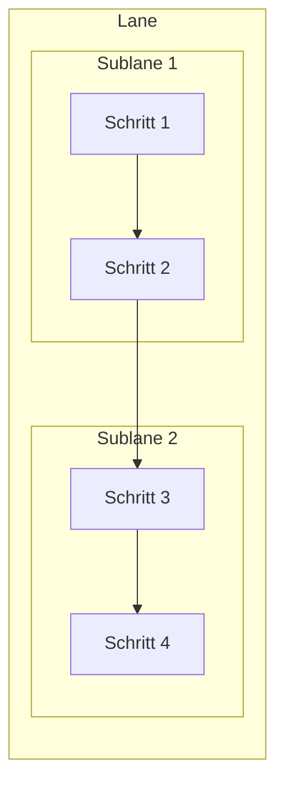

# Mermaid: zwei Sublanes, vier Schritte

Die erste Sublane schliesst ab, bevor die zweite beginnt (`Schritt 2` → `Schritt 3`).

```mermaid
flowchart TB

    subgraph lane["Lane"]
        direction TB
        subgraph sublane_one["Sublane 1"]
            direction LR
            step_1[Schritt 1]
            step_2[Schritt 2]
            step_1 --> step_2
        end
        subgraph sublane_two["Sublane 2"]
            direction LR
            step_3[Schritt 3]
            step_4[Schritt 4]
            step_3 --> step_4
        end
        step_2 --> step_3
    end
```
